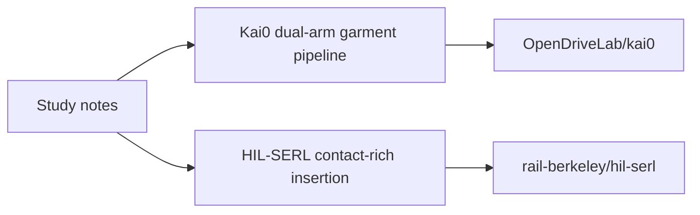

# Embodied Kai0 + HIL-SERL Study

公开学习仓库：两份真机学习笔记，加上两个上游公开代码仓库。

- 笔记 1：Kai0 / HIL-SERL 真机全流程学习大纲
- 笔记 2：简历撰写和面试准备大纲
- 上游仓库 1：[`OpenDriveLab/kai0`](https://github.com/OpenDriveLab/kai0)
- 上游仓库 2：[`rail-berkeley/hil-serl`](https://github.com/rail-berkeley/hil-serl)

这不是生产机器人系统，也不是“已经在真机上跑通”的声明。飞书课程里的嵌套 Pipeline 文档、简历模板、面经 HTML 和 PDF 没有放进来，因为当时读不到正文。

## Layout

```text
docs/第三阶段_真机全流程学习.md
docs/第四阶段_简历撰写和面试准备.md
third_party/kai0/          # submodule -> OpenDriveLab/kai0
third_party/hil-serl/      # submodule -> rail-berkeley/hil-serl
```



## Clone

HTTPS 可用。本机 GitHub SSH 公钥尚未配置，所以默认用 HTTPS。

```bash
git clone --recurse-submodules https://github.com/Yang1999code/embodied-kai0-hilserl-study.git
```

如果已经 clone 过主仓库，补拉子模块：

```bash
git submodule update --init --depth 1
```

## What is in the notes

第三阶段笔记对应长程双臂叠衣服（Kai0）和精密接触插接（HIL-SERL）。课程口径是：先把论文、代码和真机 pipeline 看懂，面试能复述，不要求你本机真的做完这两套硬件实验。

第四阶段笔记对应简历包装和面试准备。公开题库链接保留；内部简历模板和面经文件没有正文，因此只保留标题。

## Upstream projects

| Submodule | Upstream | License | Focus |
| --- | --- | --- | --- |
| `third_party/kai0` | [OpenDriveLab/kai0](https://github.com/OpenDriveLab/kai0) | Apache-2.0 | Resource-aware dual-arm garment manipulation, built on openpi |
| `third_party/hil-serl` | [rail-berkeley/hil-serl](https://github.com/rail-berkeley/hil-serl) | Apache-2.0 | Human-in-the-loop sample-efficient RL for precise real-robot insertion |

Do not treat submodule history as my original code. Attribution stays with the upstream authors.

## License

Notes and repository scaffolding: Apache-2.0.
Upstream submodules keep their own licenses.
